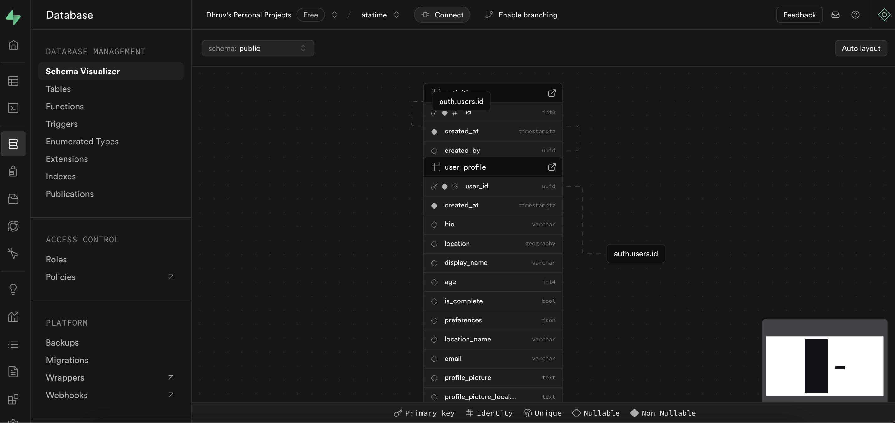
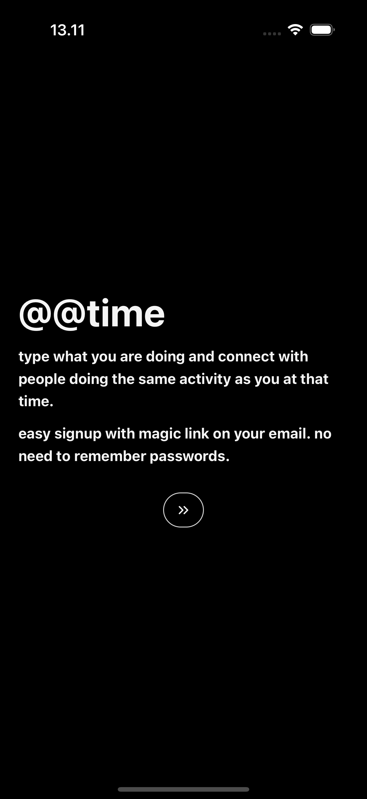
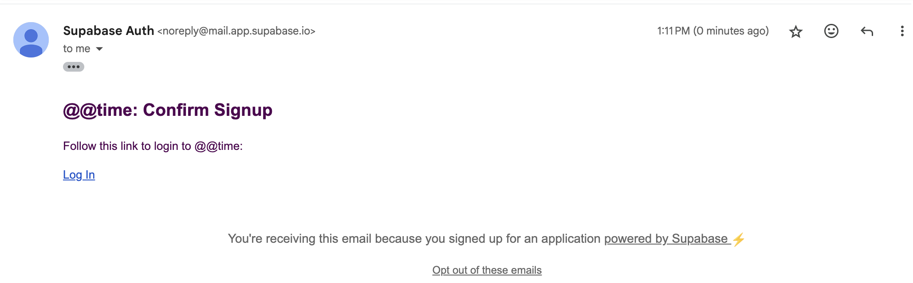
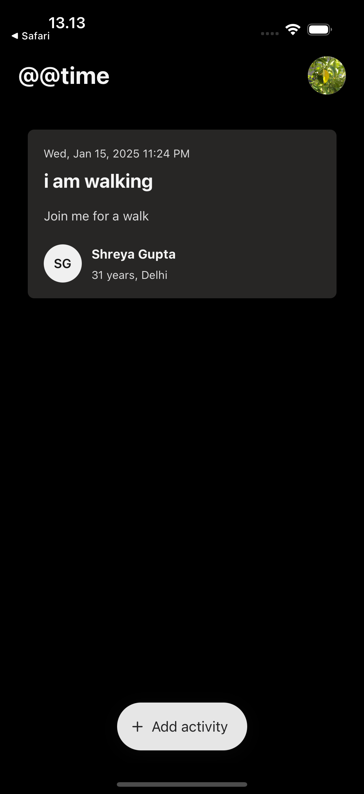
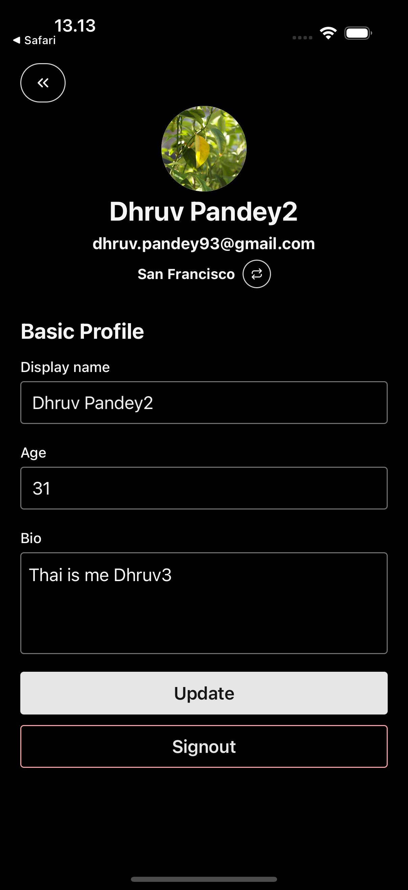
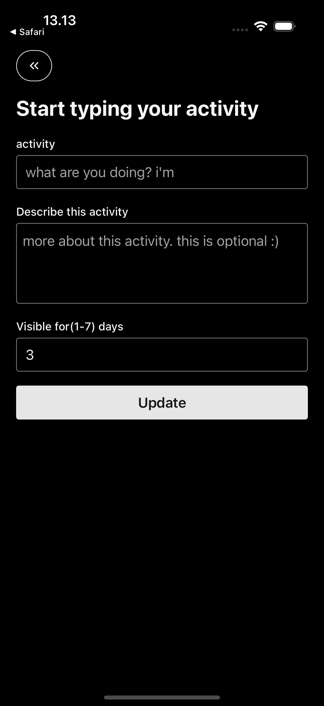
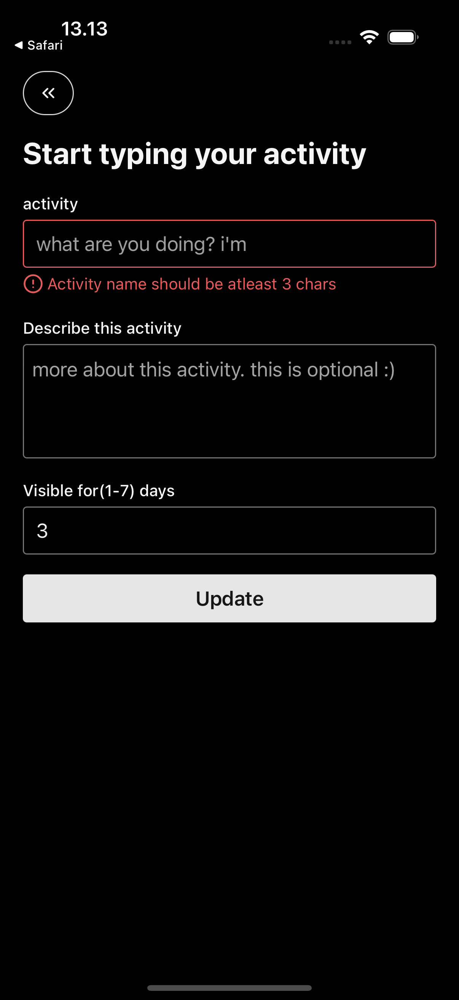
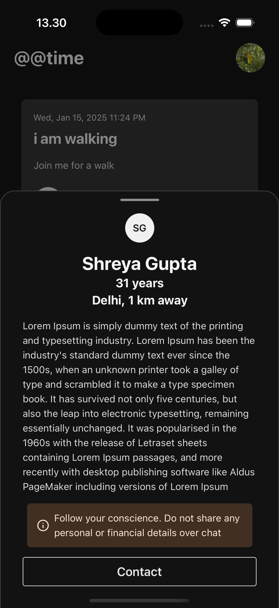

# atatime(@@time) Expo app

This app has been created using Expo and [Supabase](https://supabase.com/). Supabase is a backend as a service.

# Why Supabase

I first tried with Google Firestore, its a good solution but the major challenges were:

- Since its a No-SQL approach, creating references between collection was a problem. With Supabase its a Postgres DB, so things are sorted.
- Since the app relies too much on the location data and Geo computation, it was hard perform any filtering for the Geo data. With Supabase+PostGis this becomes quite easy.

## Why only email login

I know @@time is a social app, and why do it only support email chats and not any other social media login?

Supabase has inbuilt integration of generating and sending Verification Emails(containing Magic Links) to the specified email. Whatsapp needs Business API for signups, even Twilio does same behind the scenes which incurs cost.

One workaround was to get the device's phone number automatically and use it as a login method and allow users to connect over Whatsapp using the same mobile number. But getting the device number automatically is blocked due to security concerns.

Thats why the initial version only supports email based auth and chats. But the approach for generating Magic Links/OTP remains same and in future might be extended to other social media logins.

## Screenshots

# Supabase Dashboard



# Onboarding screen



# Signup screen


# Magic Link on mail



# Home Screen



# Profile Screen



# Activity Create Screen



# Zod Validations



# Chat Option



## How to get this app working for you

The app is not published to any store yet and has to be complied and run locally

1. Install dependencies

   ```bash
   npm install
   ```

2. Start the app

   ```bash
    npx expo start
   ```

In the output, you'll find options to open the app in a

- [development build](https://docs.expo.dev/develop/development-builds/introduction/)
- [Android emulator](https://docs.expo.dev/workflow/android-studio-emulator/)
- [iOS simulator](https://docs.expo.dev/workflow/ios-simulator/)
- [Expo Go](https://expo.dev/go), a limited sandbox for trying out app development with Expo

You can start developing by editing the files inside the **app** directory. This project uses [file-based routing](https://docs.expo.dev/router/introduction).
